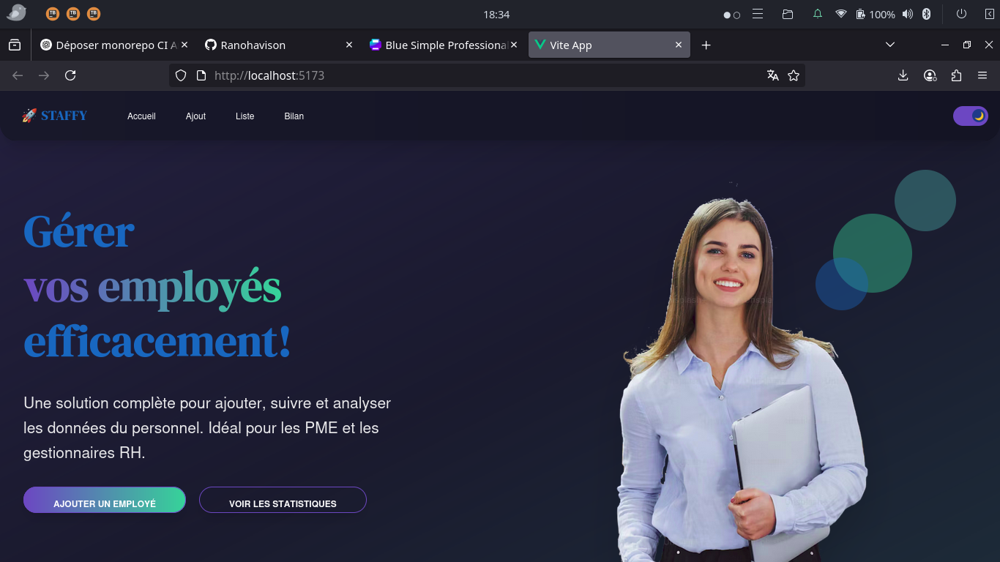
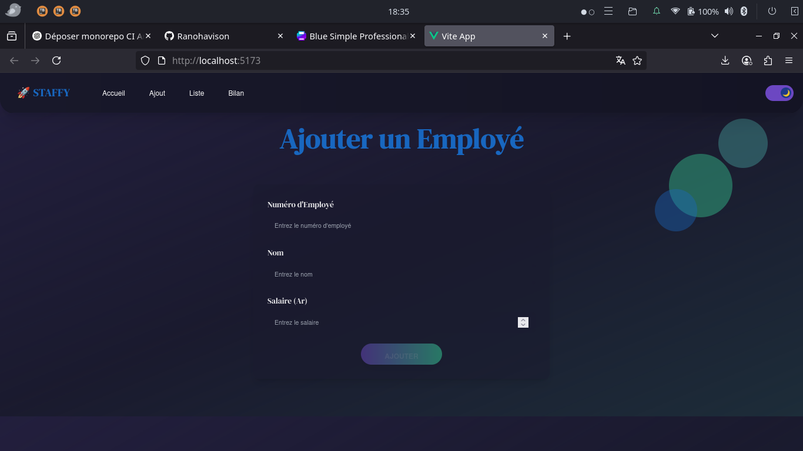
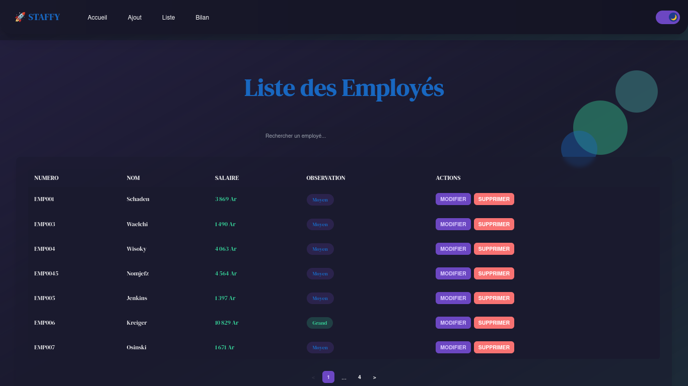
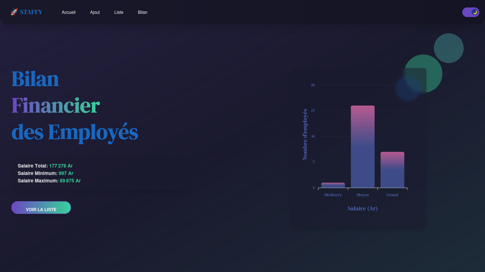

# 📋 Application de Gestion d'Employés

Une application web complète de gestion d’employés développée avec **Laravel** pour le backend, **Vue.js** pour le frontend, **MySQL** comme base de données, et stylisée avec **TailwindCSS** & **DaisyUI**.

---

## ✨ Fonctionnalités principales

- 🔐 Authentification sécurisée
- 👨‍💼 Ajout et gestion d'employés
- 📊 Vue synthétique du personnel
- 🖼️ Interface utilisateur moderne et responsive
- 🧮 Statistiques / Bilan des employés

---

## 🖼️ Aperçu de l'application

### Accueil



### Ajout d'un employé



### Affichage des employés



### Bilan / Statistiques



---

## ⚙️ Stack technique

| Technologie | Rôle                         |
|-------------|------------------------------|
| Laravel     | Backend API (RESTful)        |
| Vue.js      | Frontend SPA                 |
| MySQL       | Base de données              |
| TailwindCSS | Design utilitaire            |
| DaisyUI     | Composants UI modernes       |

---

## 🚀 Installation locale

### 1. Cloner le projet

```bash
git clone https://github.com/ton-utilisateur/ton-projet.git
cd ton-projet
